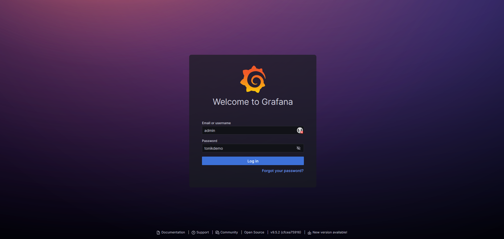
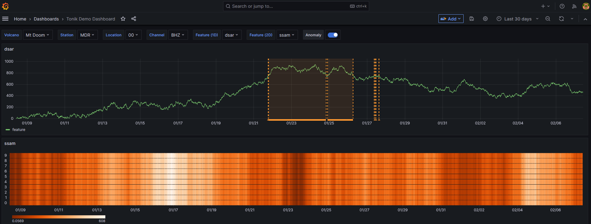

# Grafana integration

Tonik's API was written to work well with [Grafana](https://grafana.com/oss/grafana/) for visualising data and data labels.

The [repo](https://github.com/tsc-tools/tonik) contains a Grafana 
[example](https://github.com/tsc-tools/tonik/tree/main/grafana_example) that demonstrates
an example setup using [docker-compose](https://docs.docker.com/compose/).

To run the example you first have to install [docker](https://docs.docker.com/get-started/get-docker/) and [docker-compose](https://docs.docker.com/compose/install/). Then get a local copy of the repository by running:

```
git clone --depth=1 https://github.com/tsc-tools/tonik.git
```

and finally start the example by running the following commands:
```
cd tonik/grafana_example
docker-compose up --build
```

This will build and start the necessary docker containers and then start Grafana on port `11223` of your host machine. Should this port not be available you can change the port in the `docker-compose.yml` file under the `ports` section.

Navigating to [http://localhost:11223](http://localhost:11223) will show the following login screen:



Entering the shown details will then load the following demo dashboard:



To shut down the grafana instance first stop docker-compose using Ctrl-c and then clean up by running

```
docker-compose down
```
