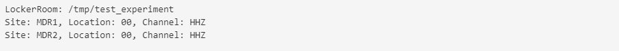
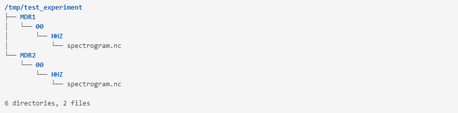

## Examples on how to store and retrieve data using lockerroom

```python
from datetime import datetime
import os
import numpy as np
import pandas as pd
import xarray as xr
from tonik import Locker, LockerRoom
```

A locker room consists of many lockers. Each locker stores data for a single sensor and the locker room groups sensors by, for example, experiment or geographic location. We will start by generating fake spectrogram data.

```python
dates = pd.date_range("2024-01-02", freq='10min', periods=288)
data = np.abs(np.cumsum(np.random.normal(0, 8., len(dates))))
data = np.tile(data, (10, 1))
freqs = np.arange(10)
xrd = xr.Dataset({'spectrogram': xr.DataArray(data, coords=[freqs, dates],
                                              dims=['frequency', 'datetime'])})
xrd['spectrogram'].plot()
```


Now we will store the data under two different sites of the same experiment.

```python
lr = LockerRoom('test_experiment')
l1 = lr.get_locker(site='MDR1', location='00', channel='HHZ')
l2 = lr.get_locker(site='MDR2', location='00', channel='HHZ')
l1.save(xrd)
l2.save(xrd)
lr
```



```
!tree /tmp/test_experiment
```


Next we want to retrieve the data we just saved. Before retrieving data we have to set the timespan over which we want to retrieve data.

```python
lr.starttime = datetime(2024, 1, 2, 18, 0, 0)
lr.endtime = datetime(2024, 1, 3, 6, 0, 0)
l = lr.get_locker('MDR2', '00', 'HHZ')
l('spectrogram').plot()
```

